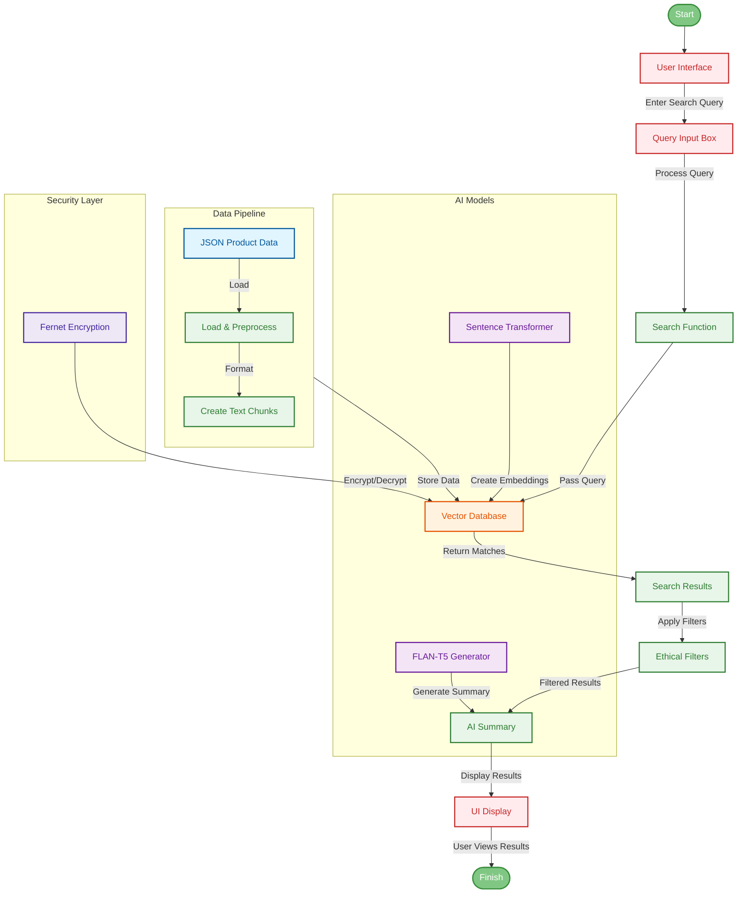

All batteries included

[](https://www.python.org/)

## Quick Start

```bash
poetry install  # Install dependencies
poetry shell    # Activate virtual environment
streamlit run main.py  # Launch app
```

Open http://localhost:8501 in your browser

Archi.

